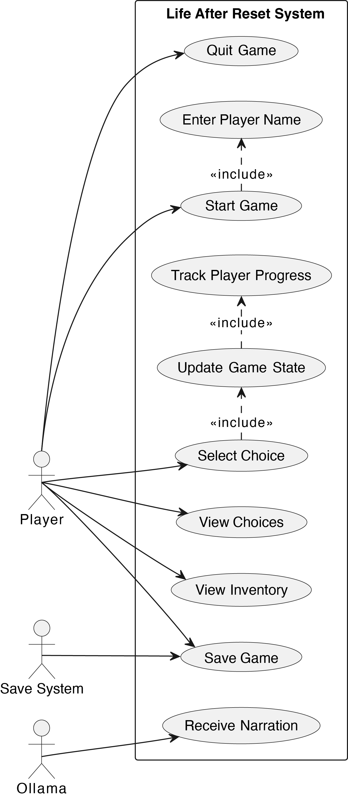

# Lab 14

## Use Case Diagram

## Completed Use Case
For this submission, I completed the `Start Game` use case beginning at the hospital. The player enters a name, starts the game, receives narration from Tom, and is presented with exactly four clickable choices in the Streamlit interface.

This playable slice also demonstrates the related flow of `View Choices`, `Select Choice`, `Update Game State`, and `Track Player Progress` because each choice changes the underlying player state and updates the visible dashboard.

The current build also includes `View Inventory`, `Save Game`, and `Quit Game` controls so the first hospital sequence is already a complete, demoable vertical slice of the project, but there is still a lot more to do. 

Over the past few weeks, I focused on building out the UI. I know it’s not required, but I want this project to be as strong as possible. The UI is about 90% complete, so my next focus is improving the AI. I’m really passionate about this project and have been putting a lot of effort into it, so please any feedback no matter how harsh is very very appreciated.